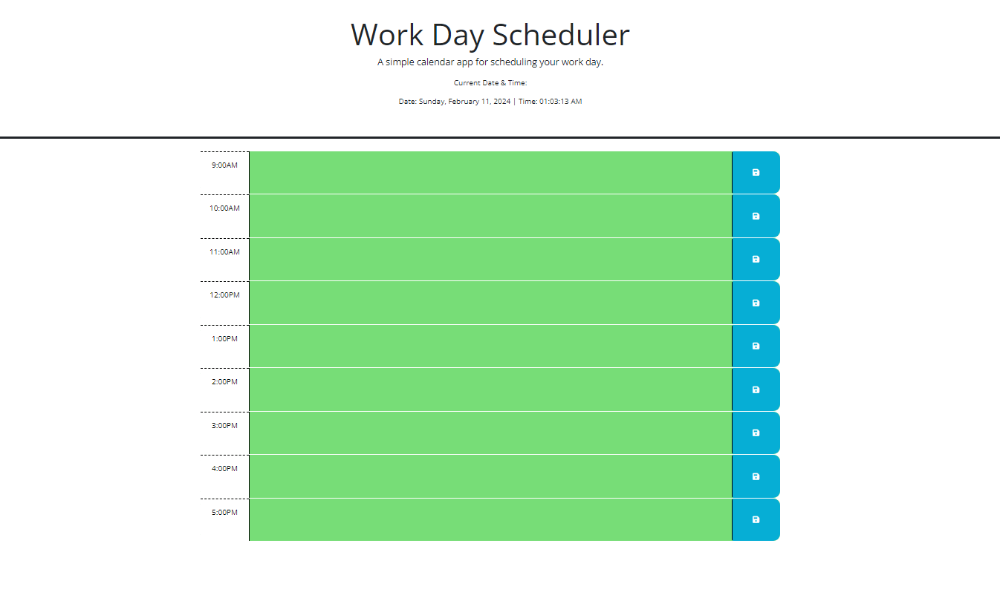

## Work Day Scheduler Assignment
This project is a Work Day Scheduler, designed to help users organize their tasks throughout the workday. It allows users to enter tasks or events for specific hours and saves them for later reference. The interface is intuitive and user-friendly, providing a clear overview of tasks scheduled for different hours of the day.

## Technologies Used:
1. HTML: Used for structuring the web page.
2. CSS: Provides styling and layout for the web page.
3. Font Awesome: Provides icons for buttons.
4. Google Fonts: Used for text styling.

## Files Included:
1. index.html: The main HTML file containing the structure of the web page.
2. style.css: The CSS file containing styles for the web page.
3. script.js: The JavaScript file containing the logic for the Work Day Scheduler.

## JavaScript Functions:
Locale Settings: Sets locale settings for the Day.js library.
Hourly Color Function: Sets the color of each time block based on the current hour of the day.
Text Entry Function: Handles saving the text entered into the text areas of each time block to local storage.
Refresh Color Function: Updates the color of each time block based on the current hour of the day.

## Screenshot of Calendar

## Link for GitHUB
https://github.com/hementB2/Assignment5

## Linkf ro Application

